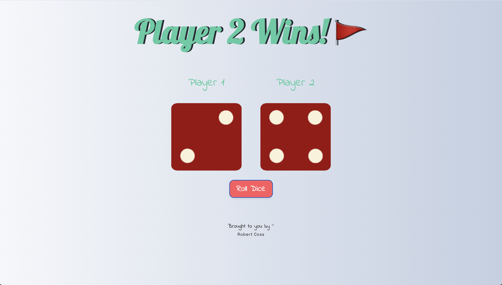

# 🎲 Dice Game

A simple interactive dice game built with HTML, CSS, and JavaScript.

## 🚀 Live Demo

👉 [Launch Dice Game](https://cossrca.github.io/Dice-Game/)

## 🚀 Features

- Two dice roll on button click
- Dice values are generated randomly
- Winner is determined based on the higher roll
- Visual dice images update to match the result

## 🛠️ Tech Stack

- HTML5
- CSS3
- JavaScript (vanilla)

## 💡 What I Learned

- DOM manipulation
- Random number generation
- Event listeners
- Basic game logic implementation

## 🖼️ Screenshot

  

